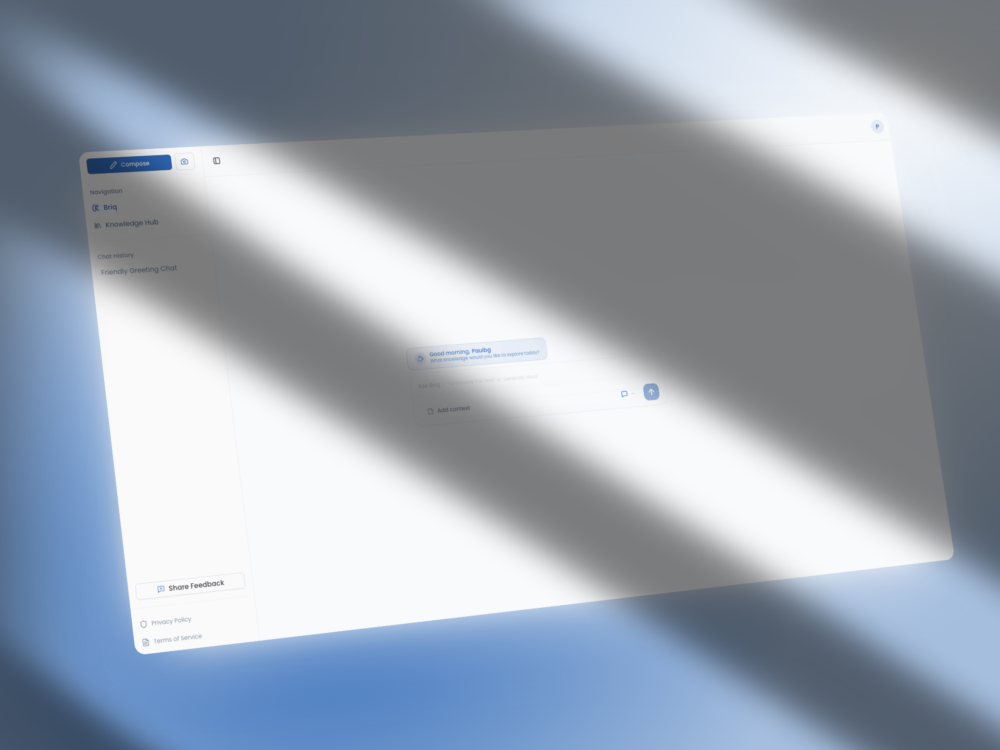

# 🧠 Nebriq

> _Write. Ask. Know._  
> A future-facing AI writing space that transforms your thoughts into a dynamic, connected knowledge system — no folders, no friction, no context lost.

---

## ✨ What is Nebriq?

**Nebriq** is an AI-powered, folderless note-taking tool designed for how your brain actually works — not how filing cabinets do.

- 📓 Just write. No need to organize stuff manually.
- 🔍 Ask questions in plain language. Get answers with references.
- 🌐 Discover hidden connections between ideas as you write.
- 🧭 Navigate your thinking like a living knowledge map.
- 📶 Built for privacy, built for devs — 100% open source.

---

## 🔥 Core Features

- 💬 **AI Chat with Your Notes**  
  Ask things like: _"What were the key points from last week’s research?"_

- 🕸 **Dynamic Knowledge Graph**  
  See how your thoughts connect. Explore patterns in real time.

- ⚡️ **Smart Search & Context Retrieval**  
  Natural language + AI = “I don’t remember the exact words” is no problem.

- 🧠 **Semantic Linking on the Fly**  
  Notes auto-connect as you write. Your knowledge evolves without extra effort.

- 🎨 **Markdown, LaTeX & Code Support**  
  Beautiful formatting for deep thinking, math, and dev workflows.

---

## 🧪 Open Source, Work in Progress

Nebriq is open source and evolving.  
The current repo reflects the core codebase, but:

- Self-hosting instructions are not yet complete
- Some features rely on paid services (e.g. Tiptap Pro)
- Migrations and environment setup may change

We’re working toward a fully self-hostable, community-friendly version.  
In the meantime, feel free to explore the code, open issues, or contribute ideas 🙏

---

## 📦 Tech Stack

- Next.js (App Router)
- Supabase (auth, storage, realtime DB)
- TypeScript
- TailwindCSS
- Pinecone (vector DB)
- Langchain (LLM)
- Tiptap (rich text editor)

---

## 🛡 License

AGPLv3 — Nebriq is free and open source.
If you run it as a public service, you’re required to share your changes too.

---

## 🌱 Roadmap

- Offline-first mode (local-first db)
- Custom LLM adapters (Ollama, LM Studio, Claude)
- Mobile-ready UI

---

## ❤️ Contributing

Nebriq is open to contributions — ideas, issues, PRs, memes, all welcome.
Let’s build the next-gen brain together.

---

## 🌀 Stay in the loop

- 🌐 Website: [nebriq.com](https://nebriq.com)
